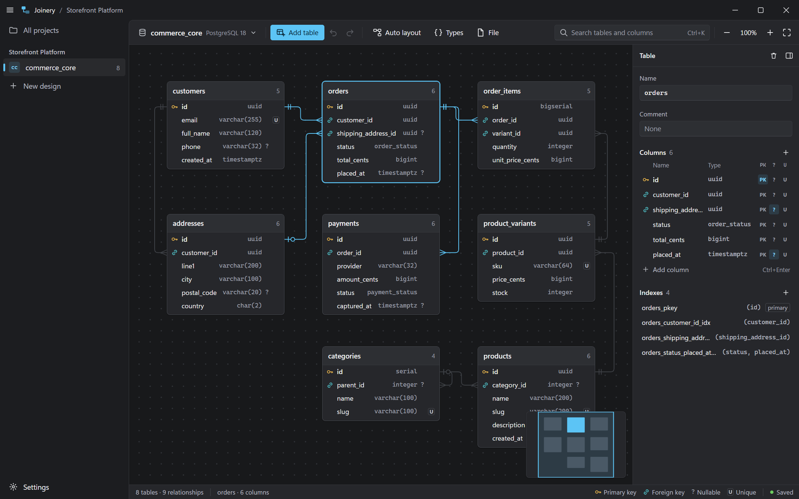

# Joinery

A desktop app for designing database schemas visually. Draw tables, connect columns, and export the result as SQL for PostgreSQL, MySQL, MariaDB, SQLite or SQL Server.



## Features

- **Visual editor**: drag tables, connect columns by dragging between them, reconnect a relationship by dragging either end, auto layout, minimap, search, notes on the canvas.
- **Schema detail**: primary keys, unique and nullable flags, defaults, comments, enum types, multi-column indexes, one-to-one and many-to-one relationships with ON DELETE / ON UPDATE actions, and a one-click junction table for many-to-many.
- **Five engines**: each design targets PostgreSQL, MySQL, MariaDB, SQLite or SQL Server. Changing the engine converts column types and defaults.
- **SQL in and out**: export a script for any supported engine, or import `CREATE TABLE` scripts to draw an existing schema.
- **Images**: export the diagram as PNG or SVG.
- **Plain files**: every project is one readable JSON file in a folder you choose.
- **Issue checker**: the status bar lists problems that would break the exported SQL, such as duplicate names or mismatched key types.

## Install

Download the installer from the [latest release](../../releases/latest):

- `Joinery_<version>_x64-setup.exe` — the recommended installer
- `Joinery_<version>_x64_en-US.msi` — for managed deployments

The installers are not code-signed, so Windows SmartScreen shows a warning the first time. Choose **More info → Run anyway**. [docs/signing.md](docs/signing.md) explains the options for signing, including the free ones.

Joinery is built and tested on Windows 10 and 11. It needs the WebView2 runtime, which is already part of Windows 11 and current Windows 10.

## Using it

See the [user guide](docs/guide.md) and the [keyboard shortcuts](docs/shortcuts.md). Press `?` in the editor for the shortcut list.

## Where your work is stored

On first launch Joinery asks where to keep projects; the default is `Documents\Joinery`. Each project gets its own folder containing a single `project.joinery.json`. You can move a project, open one from any folder, or change the default folder in Settings. The format is described in [docs/file-format.md](docs/file-format.md).

## Development

Requirements: [Bun](https://bun.sh), [Rust](https://rustup.rs) and the [Tauri prerequisites](https://tauri.app/start/prerequisites/) for Windows.

```sh
bun install
bun run tauri dev      # run the app with hot reload
bun test               # unit tests, including SQL run on SQLite and PostgreSQL
bun run typecheck
bun run tauri build    # installers in src-tauri/target/release/bundle
```

More in [docs/development.md](docs/development.md), including how releases are made.

## Changes

See [CHANGELOG.md](CHANGELOG.md).

## License

[MIT](LICENSE)
